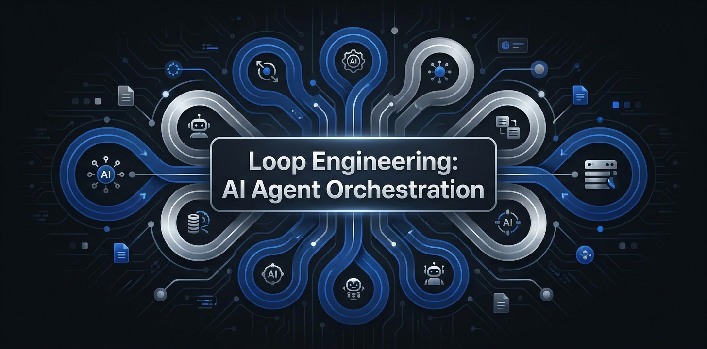

# Loop Engineering

[](docs/QUICKSTART.md)

[](docs/QUICKSTART.md)
[](tests/)
[](loop_engine/)
[](docs/)
[](LICENSE)
[](https://www.python.org/)

> **Loop engineering is replacing yourself as the person who prompts the agent.**
> You design the system that prompts your agents instead.

**Loop Engineering** is an early-stage Python runtime for building testable
agent loops that plan, act, observe, evaluate, recover, and terminate.

Unlike other frameworks that just provide patterns, Loop Engineering provides a **working Python runtime** with state machines, budget enforcement, and deterministic gates.

[Features](#features) | [Quickstart](#quickstart) | [Patterns](#patterns) | [CLI](#cli) | [Documentation](docs/) | [Contributing](CONTRIBUTING.md)

---

## Why Loop Engineering?

Current AI tools expect you to write prompts every time. Loop engineering replaces you as the prompter - you design the system that prompts your agents.

### The Problem

- **Claude Code / Codex / Grok**: You still have to prompt them every time
- **Task-specific agents**: Inflexible, hard to maintain
- **Generic frameworks**: No state management, no safety guarantees

### The Solution

Loop Engineering provides:

- **State Machine**: Explicit states with validated transitions
- **Budget Caps**: Hard limits prevent token blowout
- **Deterministic Gates**: Rule-based checks BEFORE LLM steps (Stripe Minions pattern)
- **Generator/Evaluator Separation**: Different models, temperatures, prompts
- **Human Checkpoints**: Preserve engineer control at critical points
- **Recovery Handlers**: Automatic retry with escalation
- **Persistence**: State survives crashes and restarts

---

## Features

### Architecture

```
Discovery -> Handoff -> Verification
                        |
                        v
Scheduling <- Persistence <- Human Checkpoints
```

### Key Components

| Component | Description | Anti-Pattern Prevented |
|-----------|-------------|------------------------|
| **State Machine** | Explicit states, validated transitions | Amnesiac Loop |
| **Budget Caps** | Token/cost/step limits with tracking | Runaway Budget |
| **Deterministic Gates** | Rule-based validation before LLM | Wishful Thinking |
| **Gen/Eval Separation** | Different configs for generator/evaluator | Ego Loop |
| **Human Checkpoints** | Mandatory human approval | Human Absenteeism |
| **Recovery** | Automatic retry with backoff | Infinite Retry |
| **Persistence** | State survives crashes | Amnesiac Loop |
| **Worktree Isolation** | Git worktrees per task | Tangled Loop |

---

## Quickstart (5 Minutes)

### Installation

```bash
pip install loop-engineering
```

### Create Your First Loop

```bash
# Scaffold a new project
loop-engine init --pattern daily-triage --name my-loop
cd my-loop

# Check readiness
loop-engine audit

# Run the loop (dry run first)
loop-engine run --dry-run

# Execute for real
loop-engine run
```

### Python API

```python
import asyncio

from loop_engine import RuntimeConfig, create_runtime

config = RuntimeConfig()
config.discovery.skills_dir = ".loop/skills"
config.persistence.state_dir = ".loop/state"
config.persistence.format = "sqlite"
config.handoff.default_token_budget = 100_000
config.handoff.default_cost_budget = 10.0
config.handoff.default_step_budget = 50

runtime = create_runtime(runtime_config=config, max_iterations=50)
result = asyncio.run(runtime.run())

print(f"Completed: {result.status.name}")
print(f"Tasks completed: {result.tasks_completed}")
```

The built-in runtime safely validates and persists skill contracts. External
actions such as modifying GitHub issues or posting to Slack require an explicit
tool adapter; the default runtime does not simulate those side effects.

---

## CLI Commands

### `loop-engine init` - Scaffold Projects

```bash
loop-engine init --pattern daily-triage --name my-loop
```

Creates a complete project structure:
```
my-loop/
|-- loop.yaml          # Configuration
|-- README.md          # Documentation
|-- .gitignore         # Git ignore rules
`-- .loop/
    |-- skills/        # SKILL.md files
    |-- state/         # Persistent state
    `-- worktrees/     # Git worktrees
```

### `loop-engine audit` - Readiness Score

```bash
$ loop-engine audit --suggest

Audit Results
Score: 100/100
[####################] 100%

Categories:
  Configuration: 20/20
  Structure: 15/15
  Skills: 15/15
  Documentation: 10/10
  Git: 10/10
  Safety: 15/15
  Checkpoints: 15/15
```

### `loop-engine cost` - Token Estimator

```bash
$ loop-engine cost --pattern pr-babysitter --cadence hourly

Cost Estimate: pr-babysitter
Model: claude-sonnet
Cadence: hourly

Per Run:
  Input tokens:  30,000
  Output tokens: 20,000
  Total tokens:  50,000
  Cost:          $0.1950

Monthly Estimate:
  Runs:          730
  Total tokens:  36,500,000
  Cost:          $142.35
```

### `loop-engine validate` - Check Configurations

```bash
loop-engine validate --strict
```

---

## Patterns

Loop Engineering documents seven starter patterns. Daily Triage and PR
Babysitter currently have runnable starters; the remaining patterns await
complete tool adapters and end-to-end validation:

| Pattern | Cadence | Use Case | Avg Cost/Run |
|---------|---------|----------|-------------|
| [**Daily Triage**](docs/patterns/daily-triage.md) | Daily | Review and prioritize tasks | $0.15 |
| [**PR Babysitter**](docs/patterns/pr-babysitter.md) | Per PR | Monitor and review pull requests | $0.20 |
| [**CI Sweeper**](docs/patterns/ci-sweeper.md) | On failure | Diagnose and fix CI failures | $0.35 |
| [**Dependency Sweeper**](docs/patterns/dependency-sweeper.md) | Weekly | Update and validate dependencies | $0.45 |
| [**Changelog Drafter**](docs/patterns/changelog-drafter.md) | Per release | Generate release notes | $0.25 |
| [**Post-Merge Cleanup**](docs/patterns/post-merge-cleanup.md) | Post-merge | Clean up after merges | $0.10 |
| [**Issue Triage**](docs/patterns/issue-triage.md) | Daily | Triage and route issues | $0.20 |

### Pattern Structure

Each pattern includes:
- **SKILL.md**: Complete specification (WHEN, READ, JUDGE, OUTPUT, STOP)
- **Configuration**: Pre-tuned for the pattern
- **Cost Estimates**: Heuristic planning estimates; real runs use
  provider-reported token accounting
- **Safety Guidelines**: Budget limits and checkpoints
- **Starter Template**: Clone-and-run project

---

## Tool Comparison

| Feature | Claude Code | Codex | Grok | **Loop Engineering** |
|---------|-------------|-------|------|---------------------|
| Prompt Reuse | No | No | No | Yes, SKILL.md |
| State Machine | No | No | No | Yes, full runtime |
| Budget Enforcement | No | No | No | Yes, hard limits |
| Deterministic Gates | No | No | No | Yes, pre-LLM checks |
| Gen/Eval Separation | No | No | No | Yes, different configs |
| Human Checkpoints | No | No | No | Yes, configurable |
| Recovery | No | No | No | Yes, automatic |
| Persistence | No | No | No | Yes, JSON/SQLite |
| CLI Tools | No | Yes | No | Yes, full toolkit |
| Cost Estimation | No | No | No | Yes, built-in |

**Bottom line**: Other tools are single-shot; Loop Engineering is the infrastructure for autonomous operation.

---

## Architecture

### The Five Phases

1. **Discovery**: Load state, discover tasks, build ledger
2. **Handoff**: Reserve budget, create worktree, setup generator
3. **Verification**: Run gates, generate, evaluate, human checkpoint
4. **Persistence**: Save state, update ledger
5. **Scheduling**: Determine next run

### Deterministic Gates

Gates run BEFORE LLM calls to catch issues early:

```python
from loop_engine import SyntaxGate, SecurityGate, GateRunner

runner = GateRunner()
runner.add_gate(SyntaxGate())
runner.add_gate(SecurityGate())

result = runner.run_all(context)
# If any gate fails, we don't waste tokens on the LLM
```

### Generator/Evaluator Separation

Prevents the "Ego Loop" where the LLM evaluates its own output:

```python
# Generator: High temperature for creativity
generator = GeneratorConfig(
    model="claude-3-sonnet-20240229",
    temperature=0.7,
    system_prompt="You are a code generator..."
)

# Evaluator: Low temperature, skeptical
evaluator = EvaluatorConfig(
    model="claude-3-opus-20240229",  # Different model!
    temperature=0.0,  # Deterministic
    system_prompt="You are a skeptical code reviewer..."
)
```

---

## Documentation

- [**Quickstart**](docs/QUICKSTART.md) - Get running in 5 minutes
- [**Patterns**](docs/patterns/) - Production-ready patterns
- [**Tool Comparison**](docs/tool-comparison.md) - vs Grok, Claude Code, Codex
- [**Technical Corrections**](docs/TECHNICAL_CORRECTIONS_V3.md) - What changed and why
- [**State Machine Notes**](docs/STATE_MACHINE_IMPLEMENTATION.md) - Runtime and lifecycle details
- [**Validation Reports**](docs/FINAL_VALIDATION_REPORT.md) - Audit and validation history

---

## Real-World Stories

See [`stories/`](stories/) for real-world use cases:

- **Stripe**: Deterministic gates for payment processing
- **Anthropic**: Evaluation infrastructure
- **OpenAI**: Safety-critical systems
- **Your Story Here**: [Submit a story](CONTRIBUTING.md)

---

## Contributing

We welcome contributions! See [CONTRIBUTING.md](CONTRIBUTING.md) for:

- Development setup
- Code standards
- PR process
- Adding new patterns

### Quick Development Setup

```bash
git clone https://github.com/chillum-codeX/loop-engineering.git
cd loop-engineering
pip install -e ".[dev]"
pytest tests/
```

---

## License

MIT License - see [LICENSE](LICENSE) file.

---

## Acknowledgments

- Informed by public generator/evaluator and agent-loop engineering patterns
- Inspired by Stripe's Minions pattern for deterministic gates
- State machine patterns from classical control systems

---

## Citation

If you use Loop Engineering in your research, please cite:

```bibtex
@software{loop_engineering,
  title={Loop Engineering: A Framework for Autonomous AI Systems},
  author={Loop Engineering Team},
  year={2026},
  url={https://github.com/chillum-codeX/loop-engineering}
}
```

---

<p align="center">
  <a href="docs/">Documentation</a> •
  <a href="./.github/">GitHub Setup</a> •
  <a href="docs/QUICKSTART.md">Quickstart</a>
</p>


